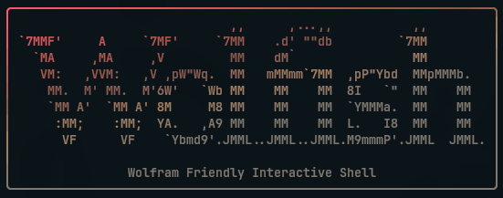
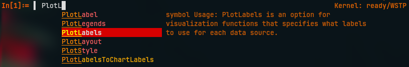
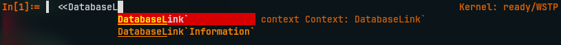
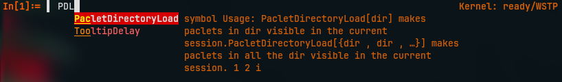
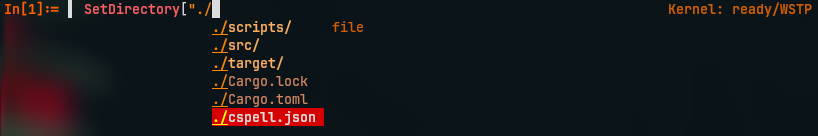
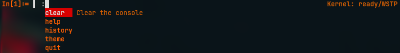

# Wolfish - **Wol**_fram_ **F**_riendly_ **I**_nteractive_ **S**_hell_



`wolfish` is a Rust CLI for running Wolfram Language from the terminal with a WSTP-backed REPL, one-shot expression evaluation, script delegation through `wolframscript`, and dynamic completions.

It does not intent to replace wolframscript for script/file evaluation and is intended only as a more user friendly terminal REPL.

The TUI is self contained within the single `wolfish` binary and does not bundle the Wolfram Kernel.

## Installation
To pin a specific beta release tag, add `--version v0.5.0`.

Platform-specific installers are also available. Omit the version option to install the latest GitHub release, or pass `--version v0.5.0` / `-Version v0.5.0` to install this beta explicitly.

### WolframScript (All platforms)
```sh
wolframscript -file https://raw.githubusercontent.com/ToneAr/wolfish/main/installers/install.wls
```

### Bash (Unix)
```sh
curl -fsSL https://raw.githubusercontent.com/ToneAr/wolfish/main/installers/install.sh | bash
```

### PowerShell (Windows)
```powershell
irm https://raw.githubusercontent.com/ToneAr/wolfish/main/installers/install.ps1 | iex
```

## Usage
`wolfish` has three user-facing execution modes:

| Mode                | Command                      | Backend |
| ---                 | ---                          | --- |
| Interactive REPL    | `wolfish` or `cargo run`     | Native WSTP session |
| One-shot expression | `wolfish -e 'Range[5]^2'`    | Native WSTP session |
| Script file         | `wolfish script.wls -- arg1` | Delegated to `wolframscript` |

For a detailed architecture and evaluation pipeline walkthrough, including WSTP packet flow diagrams, see [`docs/Architecture.md`](docs/Architecture.md).

Start the interactive REPL. This uses the native WSTP backend and keeps a kernel session alive for REPL state:
```sh
wolfish
```

Evaluate one expression and exit:
```sh
wolfish -e 'Range[5]^2'
```

Run a script file through `wolframscript` **[WIP]**:
```sh
wolfish path/to/script.wls -- arg1 arg2
```

However, all non-interactive script execution should be defer back to `wolframscript`.

## TL;DR
Quick list of all features:
1. **Symbol completion**
   
2. **Context completion**
   
3. **Fuzzy matching** **[WIP]**
   
4. **File and directory autocomplete**
   
5. **System command completion**
   

## Completion
### Details

| Keybind        | Description |
| ---            | --- |
| `Enter`        | Evaluate input |
| `Ctrl + C`     | Abort evaluation **[WIP]** |
| `Ctrl + D`     | Exit the program |
| `Ctrl + R`     | Open history browser |
| `Tab`          | Accept currently selected completion or open completion menu |
| `Ctrl + Space` | Open completion menu |
| `Esc`          | Close completion menu |

The REPL opens an IDE-style completion popup dynamically as you type symbol characters. Use `Tab` to cycle/accept entries, `Shift+Tab` to move backward, and `Esc` to close the popup.

Symbol completions are queried from the active kernel session as you type, so user-defined symbols, functions, and loaded package symbols are included after each evaluation. The query uses prefix-shaped `Names` calls, for example:

```wl
Names[StringJoin[ prefix, "*"]]
```

Matching context names are suggested from `Contexts[]`, and qualified input such as `MyContext`My` queries symbols inside that context.

When the cursor is inside a function call after the first top-level comma, option completions are loaded lazily from:

```wl
Options[head]
```

For example, `Plot[x, {x, 0, 1}, PlotR` can complete `PlotRange`.

Disable ANSI coloring with:

```sh
wolfish --no-color
```

## Commands
Lines that start with `:` are handled by the CLI instead of being evaluated as Wolfram Language input:

| Command       | Description |
| ---           | --- |
| :clear        | Clear the console |
| :help         | Print help message |
| :history      | Search command history |
| :theme        | Cycle current theme |
| :theme {name} | Set theme to {name} |
| :theme list   | List all theme names |
| :theme show   | Show current theme |
| :quit         | Quit the shell |

Command completions are available only when the line starts with `:`. Wolfram Language completions are disabled for those command lines.

## Themes
Theme selections made with `:theme` or `:theme {name}` are persisted to the user config file and restored the next time the REPL starts.

Default user paths:

| Purpose | Unix/Linux | Windows |
| --- | --- | --- |
| Settings | `$XDG_CONFIG_HOME/wolfish/config.json` or `~/.config/wolfish/config.json` | `%APPDATA%\\wolfish\\config.json` |
| Custom themes | `$XDG_CONFIG_HOME/wolfish/themes/*.json` or `~/.config/wolfish/themes/*.json` | `%APPDATA%\\wolfish\\themes\\*.json` |

Custom theme files are picked up automatically at REPL startup and shown by `:theme list`. Theme names cannot contain whitespace. A custom theme may inherit from a built-in `base` theme (`dark`, `light`, `solarized`, `gruvbox`, `monokai`, or `plain`) and override any subset of style fields:

```json
{
  "name": "my-theme",
  "base": "dark",
  "styles": {
    "string": "#d7af5f",
    "comment": {
        "fg": 244,
        "italic": true
    },
    "number": {
        "fg": "bright-yellow"
    },
    "builtin_symbol": {
        "fg": "cyan",
        "bold": true
    },
    "visual_selection": {
        "fg": "white",
        "bg": "#5f0000"
    },
    "prompt_left": {
        "fg": "bright-red",
        "bold": true
    }
  }
}
```

Colors can be ANSI indexes (`208`), RGB arrays (`[255, 128, 0]`), hex strings (`"#ff8000"`), or common color names such as `red`, `cyan`, `bright-blue`, and `dark-gray`.

## Kernel Discovery
Set `WOLFRAM_KERNEL` to override the kernel executable. Without that override, the CLI asks `wolframscript -showkernels` for the best local kernel path, falls back to `wolfram-app-discovery`, and prefers the native kernel binary under `SystemFiles/Kernel/Binaries` before falling back to `WolframKernel` on `PATH`.

Set `WOLFRAM_FRONTEND` to override the FrontEnd executable used for FrontEnd-backed completions and rendering support.

## Kernel during build
The `wstp` crate links Wolfram's WSTP static library at build time. A build machine must have a Wolfram installation or WSTP SDK for the Rust target being built. If discovery does not find it, set `WSTP_COMPILER_ADDITIONS_DIRECTORY` to the target's `SystemFiles/Links/WSTP/DeveloperKit/<SystemID>/CompilerAdditions` directory.

## Release Builds
GitHub Actions builds packaged binaries when a `v*` or `build*` tag is pushed. `test*` tags and manual workflow runs exercise the build/test path without packaging or publishing artifacts, unless the manual run is explicitly started from a `v*` or `build*` tag ref.

Release builds run on GitHub-hosted runners. Because GitHub-hosted runners do not include Wolfram and `wstp-sys` links the target WSTP static library during `cargo build`, the workflow extracts the required `CompilerAdditions` from official Wolfram Engine artifacts before building:

| Artifact         | Runner           | Rust target                | WSTP source                 |
| ---              | ---              | ---                        | --- |
| `linux-x86_64`   | `ubuntu-latest`  | `x86_64-unknown-linux-gnu` | Wolfram Engine Docker image |
| `macos-x86_64`   | `macos-15-intel` | `x86_64-apple-darwin`      | Wolfram Engine macOS DMG    |
| `macos-aarch64`  | `macos-15`       | `aarch64-apple-darwin`     | Wolfram Engine macOS DMG    |
| `windows-x86_64` | `windows-latest` | `x86_64-pc-windows-msvc`   | Wolfram Engine Windows MSI  |

Locally, set `WSTP_COMPILER_ADDITIONS_DIRECTORY` if automatic discovery does not find the target's `SystemFiles/Links/WSTP/DeveloperKit/<SystemID>/CompilerAdditions` directory. Linux builds also need the system `uuid` library available for linking, for example the `uuid-dev` package on Debian/Ubuntu systems.

The packaged binary locates the user's Wolfram installation at runtime using the discovery behavior above. Expression, REPL, and completion evaluation run over WSTP; script files are delegated to `wolframscript`.

## Regenerating build-time kernel data
Builds embed pre-generated kernel data from files committed under `build_tools/`; they do not launch `WolframKernel` during `cargo build`. When the generated data needs to be refreshed, run:

```sh
build_tools/generate-kernel-data.sh
```

Set `WOLFRAM_KERNEL=/path/to/WolframKernel` to force a specific kernel. The script currently regenerates `build_tools/builtin_symbols.tsv`; commit that file with the source change that requires the refresh.
