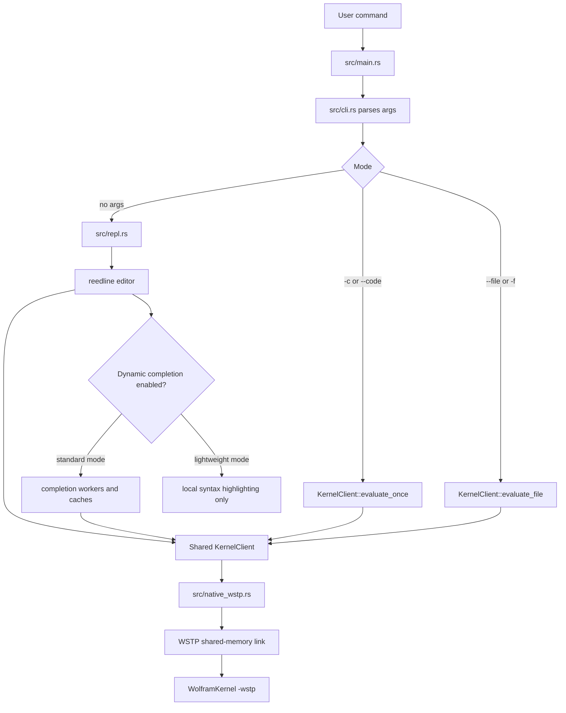
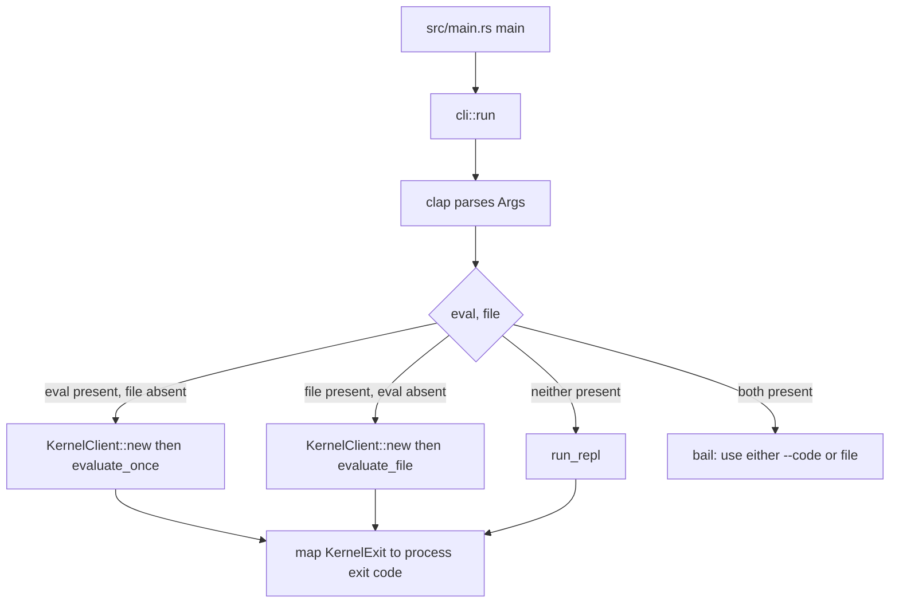
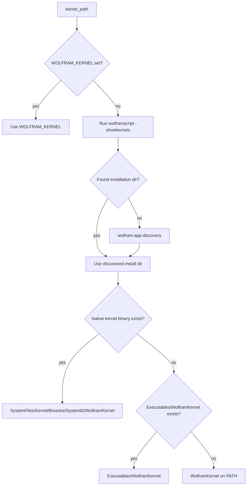
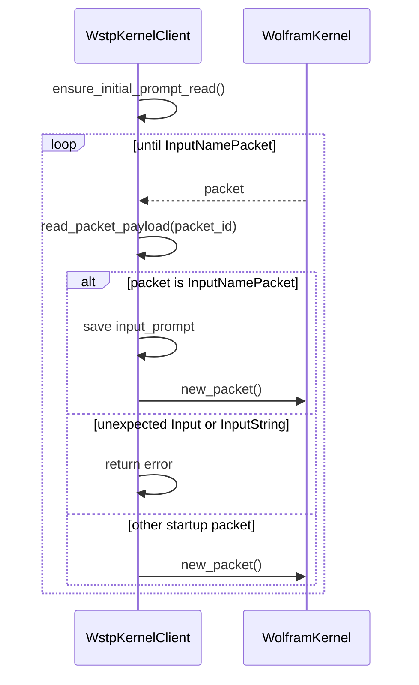
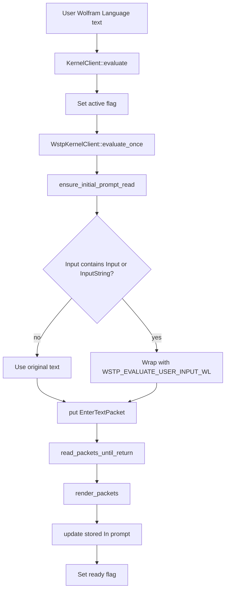
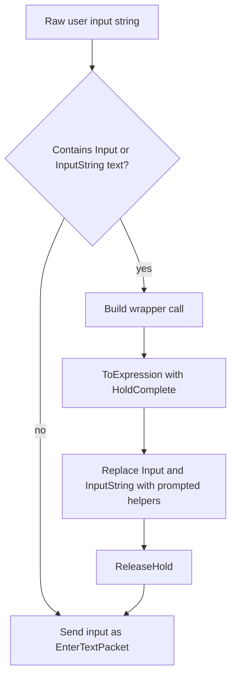
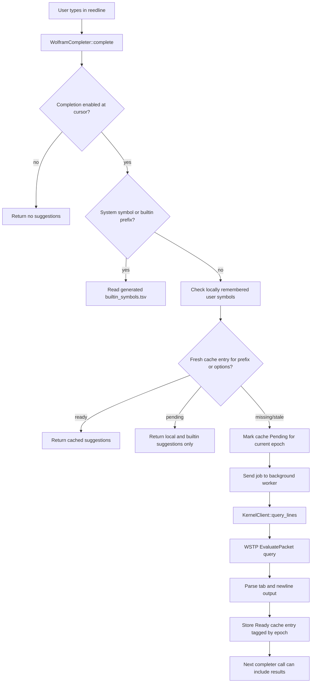
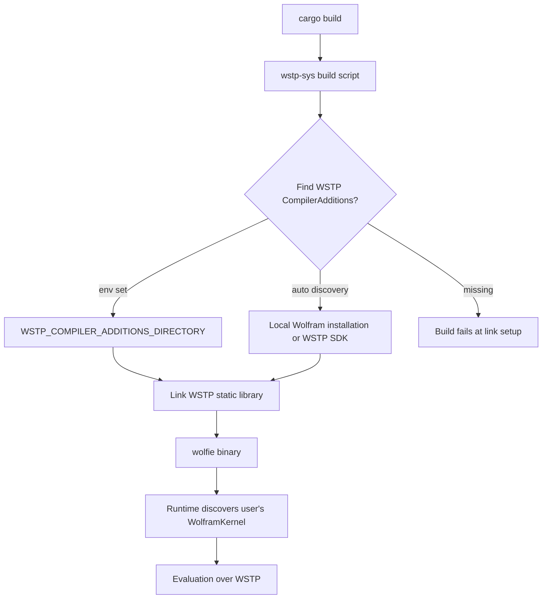
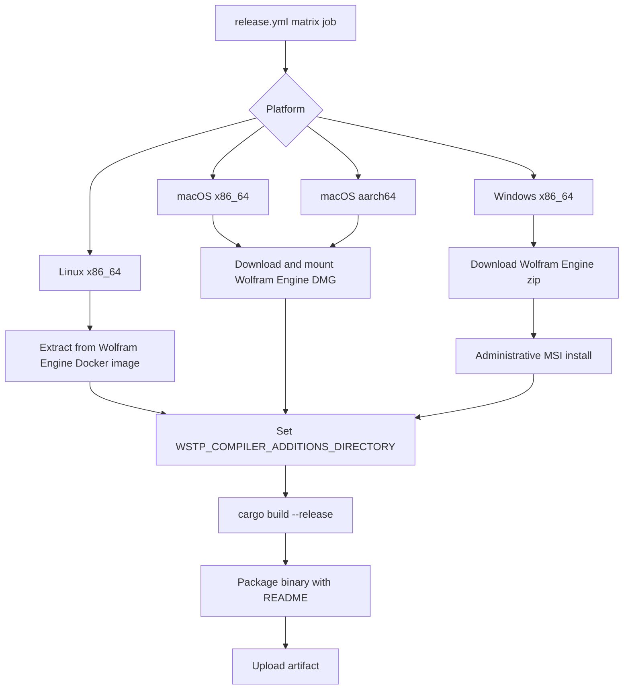
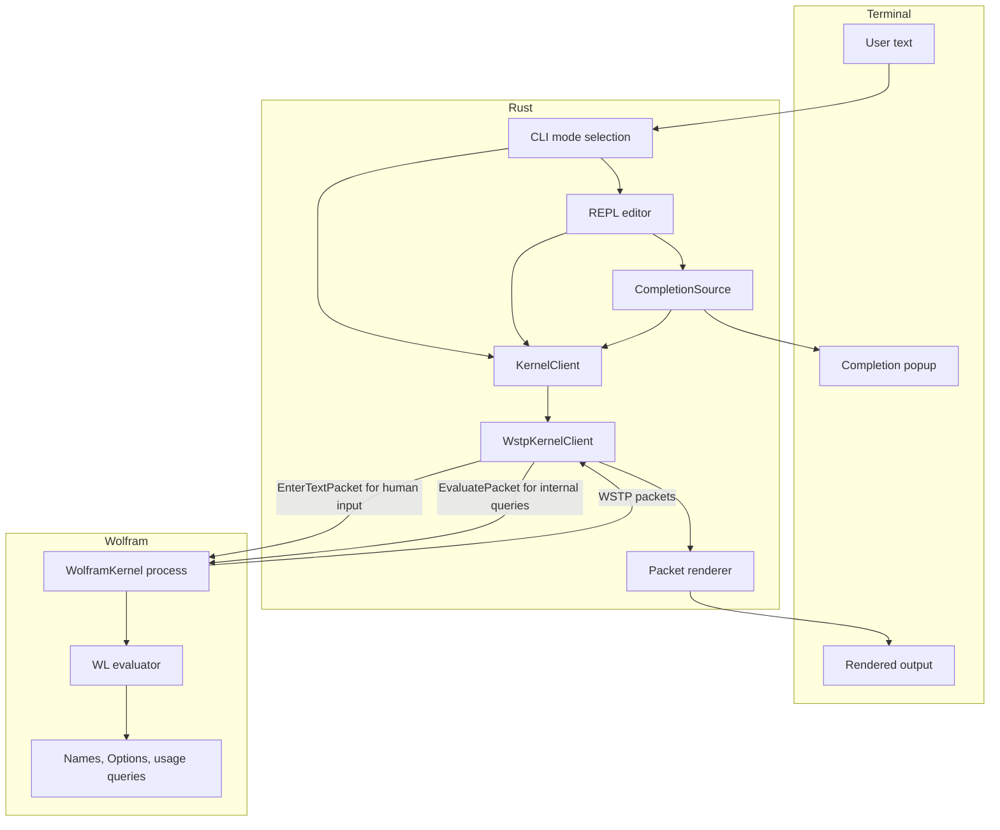

# Wolfie workflow

This document describes how `wolfie` starts, evaluates Wolfram Language input, talks to the Wolfram Kernel over WSTP, serves completions, and builds release artifacts.

## High-level architecture

`wolfie` is a Rust terminal application with three user-facing execution modes:

1. Interactive REPL, the default `wolfie` / `cargo run` path.
2. One-shot expression evaluation with `--code` / `-c`.
3. Script execution with `--file` / `-f`.

All three execution modes use the native WSTP backend. Script files are read by
`wolfie`, sent over the selected WSTP connection, split into top-level Wolfram
Language expressions by the kernel reader, and evaluated sequentially in that
session.



### Lightweight REPL profile

`wolfie --lightweight` keeps the core REPL and WSTP evaluation path unchanged but does not construct optional resource-intensive subsystems. It skips the background kernel warm-up thread/query, `CompletionSource` and its two workers/three caches, dynamic highlighter queries and context prefetch, and persistent/in-memory history retention. The built-in symbol table and local user-symbol tracking remain available for local highlighting. Standard mode retains the existing behavior.

## Startup and mode selection

The entry point is intentionally thin:



### CLI modes

| Mode                | User command                       | Runtime path                  | Kernel lifetime                 | Backend |
| ------------------- | ---------------------------------- | ----------------------------- | ------------------------------- | ------- |
| REPL                | `wolfie`                           | `run_repl`                    | Persistent until quit           | WSTP    |
| One-shot expression | `wolfie -c 'Range[5]^2'`           | `KernelClient::evaluate_once` | One process for that evaluation | WSTP    |
| Script file         | `wolfie --file script.wls -- arg1` | `KernelClient::evaluate_file` | One process for that script     | WSTP    |

## Kernel discovery

`KernelClient::new` creates a `native_wstp::WstpKernelClient`, which first resolves the kernel executable. Discovery is in `src/kernel.rs`:



## WSTP launch pipeline

The native WSTP backend starts a Wolfram Kernel in WSTP mode and connects to it over a shared-memory link.

```mermaid
sequenceDiagram
    participant Rust as wolfie Rust process
    participant Link as WSTP listener Link
    participant OS as OS process launcher
    participant Kernel as WolframKernel

    Rust->>Rust: kernel_path()
    Rust->>Link: Link::listen(SharedMemory, "")
    Link-->>Rust: link_name
    Rust->>OS: spawn WolframKernel -wstp -linkprotocol SharedMemory -linkconnect -linkname link_name
    OS->>Kernel: start child process
    Rust->>Link: activate()
    Kernel->>Link: connect to shared-memory link
    Link-->>Rust: activated
    Rust->>Rust: store Child and Link in WstpKernelClient
```

The exact launch command is assembled in `src/native_wstp.rs`:

```text
WolframKernel \
  -wstp \
  -linkprotocol SharedMemory \
  -linkconnect \
  -linkname <generated-link-name>
```

The child process has stdin, stdout, and stderr redirected to `null`; all evaluation communication happens through WSTP packets.

## Initial prompt handshake

The kernel sends an initial `InputNamePacket`, typically containing `In[1]:=`, before the first user evaluation. The client delays reading that packet until the first actual evaluation or query.



This is why the first REPL interaction can be slower: the kernel process and WSTP link are already started, but the first prompt/readiness handshake and first evaluation setup still need to complete. The REPL overlaps that cost with user think time by running `spawn_kernel_warmup`, which performs a background `query_string("Null")`.

REPL initialization also creates service and preemptive WSTP listeners and asks
the kernel's `MathLink`CreateFrontEndLinks`machinery to connect to them. The
main link remains responsible for submitted evaluations, while asynchronous`TaskObject` output arrives on the service link. An idle packet pump drains that
link under the shared kernel mutex and sends rendered output through Reedline's
external printer, whose timed polling preserves and repaints the active edit
buffer. The preemptive link is registered as a sharing link so the kernel can
run scheduled work while the main link is idle.

## Human evaluation pipeline

Human-entered input uses `EnterTextPacket`, which asks the kernel to parse and evaluate exactly as notebook-style textual input.

This path is used by:

- `KernelClient::evaluate_once` for `-c` / `--code`.
- `KernelClient::evaluate_repl_input` for REPL submissions.



### User input rewriting for `Input` and `InputString`

Plain WSTP `InputPacket` and `InputStringPacket` have different response shapes. To make interactive `Input[...]` and `InputString[...]` work in the terminal, the client rewrites only inputs that contain those constructs.

The wrapper source is embedded from `src/wl/wstp_evaluate_user_input.wl` and then called as a Wolfram function:

```text
(<contents of wstp_evaluate_user_input.wl>)["original user input"]
```

The wrapper:

1. Parses the original text using `ToExpression[input, InputForm, HoldComplete]`.
2. Replaces `Input[prompt]` and `InputString[prompt]` with prompt-aware local helper functions.
3. Prints the prompt text to `$Output`.
4. Calls the kernel's `Input[]` or `InputString[]` so the client receives the corresponding WSTP input request.
5. Releases the held expression for evaluation.
6. Temporarily suppresses `General::shdw` while parsing.



## WSTP packet flow for REPL evaluation

For human evaluation, `read_packets_until_return` reads packets until it has both the evaluation result and the next prompt. That is why `read_next_input_name` is `true` for `EnterTextPacket` evaluations.

```mermaid
sequenceDiagram
    participant REPL as REPL or one-shot caller
    participant Client as WstpKernelClient
    participant Link as WSTP Link
    participant Kernel as WolframKernel

    REPL->>Client: evaluate_once(input, theme, input_handler)
    Client->>Client: ensure_initial_prompt_read()
    Client->>Link: EnterTextPacket[input]
    Client->>Link: flush()

    loop packet loop
        Kernel-->>Client: next packet
        Client->>Client: decode into KernelPacket
        alt InputPacket
            Client->>REPL: ask input_handler for expression text
            REPL-->>Client: response
            Client->>Link: EnterTextPacket[response]
        else InputStringPacket
            Client->>REPL: ask input_handler for string text
            REPL-->>Client: response
            Client->>Link: raw string response packet
        else Return, ReturnExpression, ReturnText, or Syntax
            Client->>Link: new_packet()
            Client->>Client: keep reading for next InputNamePacket
        else following InputNamePacket
            Client->>Client: save next prompt
            Client->>Link: new_packet()
            Client-->>REPL: packets complete
        else nonterminal packet
            Client->>Link: new_packet()
        end
    end

    Client->>REPL: render_packets(packets)
```

### Packet handling table

| WSTP packet                               | Internal enum                               | Main behavior                                                                                                                      |
| ----------------------------------------- | ------------------------------------------- | ---------------------------------------------------------------------------------------------------------------------------------- |
| `InputNamePacket`                         | `KernelPacket::InputName`                   | Stores or updates the displayed `In[n]:=` prompt.                                                                                  |
| `OutputNamePacket`                        | `KernelPacket::OutputName`                  | Saved and printed before the following return value.                                                                               |
| `TextPacket`                              | `KernelPacket::Text`                        | Printed directly unless it is the prompt text immediately before an input request.                                                 |
| `MessagePacket`                           | `KernelPacket::Message`                     | Identifies the following message `TextPacket`; that text is printed immediately, including while the initial prompt is being read. |
| `ReturnPacket` / `ReturnExpressionPacket` | `KernelPacket::Return` / `ReturnExpression` | Rendered as expression text, or as the raw string if the expression is a string.                                                   |
| `ReturnTextPacket`                        | `KernelPacket::ReturnText`                  | Rendered as text.                                                                                                                  |
| `SyntaxPacket`                            | `KernelPacket::Syntax`                      | Printed as `Syntax error at position n`.                                                                                           |
| `InputPacket`                             | `KernelPacket::Input`                       | REPL asks the user for expression input and responds with `EnterTextPacket`.                                                       |
| `InputStringPacket`                       | `KernelPacket::InputString`                 | REPL asks the user for string input and responds with a raw string packet.                                                         |
| `ExpressionPacket`                        | `KernelPacket::EnterExpression`             | Renders asynchronous boxed output from the service link as terminal text.                                                          |
| Dialog/menu/display/call packets          | Matching `KernelPacket` variants            | Decoded and either printed diagnostically or ignored, depending on packet type.                                                    |

### Prompt update strategy

After evaluation, the client updates its prompt by trying these sources in order:

```mermaid
flowchart TD
    Packets[Evaluation packets] --> LastInput{Last non-empty InputNamePacket?}
    LastInput -->|yes| UseInput[Use that as next prompt]
    LastInput -->|no| LastOutput{Last OutputNamePacket?}
    LastOutput -->|yes| OutputIncrement[Parse Out[n] and use In[n+1]:=]
    LastOutput -->|no| Previous{Previous prompt available?}
    Previous -->|yes| PreviousIncrement[Increment previous In[n]:=]
    Previous -->|no| NoUpdate[No prompt update]
```

## Query evaluation pipeline

Completion and other internal lookups need a string result, not human-formatted REPL output. Those calls use `KernelClient::query_string`, which maps to `WstpKernelClient::evaluate_to_string`.

Unlike human input, query evaluation sends an `EvaluatePacket` containing a Wolfram expression built with `wolfram-expr`:

```text
EvaluatePacket[
  ToExpression["Module[{wolframCliQueryResult$ = (<query>)}, ...]"]
]
```

The wrapper generated by `wrap_to_string_query` behaves like this:

```wl
Module[{wolframCliQueryResult$ = (<query>)},
  If[
    StringQ[wolframCliQueryResult$],
    wolframCliQueryResult$,
    ToString[wolframCliQueryResult$, InputForm]
  ]
]
```

That distinction matters because many completion queries intentionally return tab- or newline-delimited strings. If string results were passed through `ToString[..., InputForm]`, real tabs and newlines would become escaped text and the Rust parser would split them incorrectly.

```mermaid
sequenceDiagram
    participant Caller as Completion/query caller
    participant KernelClient as KernelClient
    participant Client as WstpKernelClient
    participant Link as WSTP Link
    participant Kernel as WolframKernel

    Caller->>KernelClient: query_string(code)
    KernelClient->>Client: evaluate_to_string(code)
    Client->>Client: wrap_to_string_query(code)
    Client->>Client: build ToExpression string expression
    Client->>Client: ensure_initial_prompt_read()
    Client->>Link: EvaluatePacket[expr]
    Client->>Link: flush()

    loop until terminal packet
        Kernel-->>Client: packet
        Client->>Client: decode packet
        alt terminal result packet
            Client->>Client: extract Return, ReturnExpression, or ReturnText text
            Client-->>KernelClient: string result
        else nonterminal packet
            Client->>Link: new_packet()
        end
    end

    KernelClient-->>Caller: String
```

For query evaluation, `read_next_input_name` is `false`, so the packet loop returns as soon as it sees a terminal result packet. It does not wait for the next `InputNamePacket`.

## Completion workflow

The completion system is designed so the input thread never blocks on kernel I/O.



Important pieces:

- `src/completion.rs` owns `CompletionSource`, async caches, worker channels, and kernel-backed query logic.
- Built-in symbols are generated at build time into `OUT_DIR/builtin_symbols.tsv` and served locally.
- Kernel-backed symbol completions call the embedded WL query in `src/wl/symbol_completion_query.wl`.
- Symbol details call `src/wl/symbol_details_batch_query.wl`.
- Option completions call `src/wl/options_query.wl`.
- After each successful user evaluation, `remember_user_symbols` records obvious user-defined symbols and `completion_epoch` increments. Cache entries include the epoch so stale in-flight completion results are ignored naturally.

## REPL lifecycle

```mermaid
stateDiagram-v2
    [*] --> Start
    Start --> CreateKernel: KernelClient::new
    CreateKernel --> Warmup: spawn query_string("Null")
    Warmup --> PromptLoop

    PromptLoop --> ReadLine: reedline.read_line
    ReadLine --> PromptLoop: empty input
    ReadLine --> Command: starts with colon
    Command --> PromptLoop: continue
    Command --> Exit: quit command
    ReadLine --> Exit: Quit, Exit, Ctrl-D
    ReadLine --> Evaluate: Wolfram input
    Evaluate --> HandleInput: kernel requests Input/InputString
    HandleInput --> Evaluate: send response
    Evaluate --> Render: terminal packet and next prompt read
    Render --> Remember: remember_user_symbols and epoch plus one
    Remember --> PromptLoop

    Exit --> DropKernel
    DropKernel --> [*]
```

When the REPL exits, `WstpKernelClient` is dropped. Its `Drop` implementation closes the main, service, and preemptive links without running normal link destruction, waits briefly for the child kernel to exit, then kills and waits for it if needed.

## Build and release WSTP pipeline

Runtime evaluation requires WSTP, and the Rust `wstp` crate links Wolfram's WSTP library at build time. A build machine must provide the target platform's WSTP `CompilerAdditions` directory.



GitHub Actions runners do not include Wolfram Engine by default, so release builds extract `CompilerAdditions` from official Wolfram Engine artifacts before running `cargo build`.



## End-to-end visual summary



## Practical debugging checklist

When evaluation behavior is wrong, check the pipeline in this order:

1. **Mode selection**: confirm whether the path is REPL, `--code`, or script file delegation.
2. **Kernel discovery**: set `WOLFRAM_KERNEL` to a known `WolframKernel` binary to bypass discovery.
3. **WSTP launch**: verify the kernel can start with `-wstp` and the platform has matching WSTP libraries at build time.
4. **Initial prompt**: first-use delays often happen while reading the initial `InputNamePacket` and doing the first real evaluation.
5. **Packet stream**: enable profiling or add packet tracing around `trace_packet` in `src/native_wstp.rs`.
6. **Human vs query path**: remember that user evaluation uses `EnterTextPacket`, while completions and internal lookups use `EvaluatePacket` plus `wrap_to_string_query`.
7. **Input prompts**: `Input[]` and `InputString[]` use the terminal input handler in the REPL, one-shot `--code`, and script modes.
8. **Completion staleness**: after evaluation, the completion epoch increments; old cache entries should not be reused.
